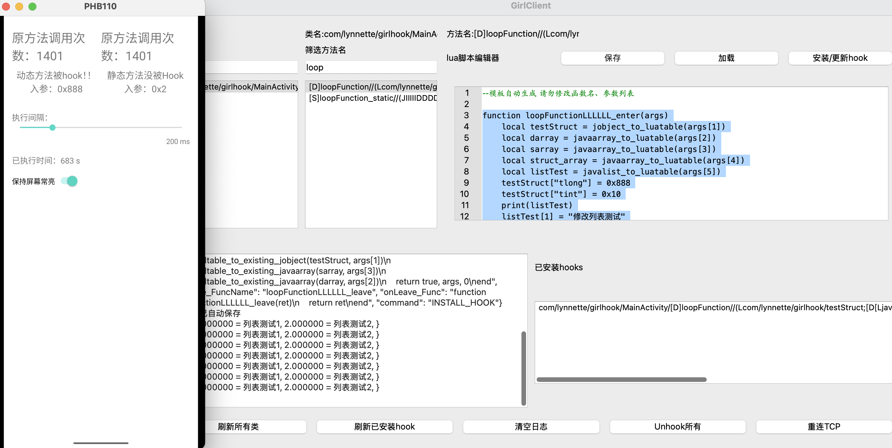

# G.I.R.L

​	G.I.R.L. — Gadget-Injection Runtime for Lua。支持LUA脚本的轻量化android JAVA方法hook框架。可用于逆向分析与开发测试。

组件：

https://github.com/Lynnette177/GirlLoader

https://github.com/Lynnette177/GirlClient

演示视频：

https://www.bilibili.com/video/BV1s9KmzVE1i/

## 开发初衷：

​	Frida被频繁检测；新版本frida各种bug无法正常使用；需要一款可集成可外置的hook框架，最好具有图形界面；代码不要太臃肿，便于技术原理的分享学习。

## 依赖的库

​	在此感谢GitHub上这些开源项目。没有这些项目就没有GirlHook。

- TInjector:https://github.com/Mrack/TInjector     将libgirlhook.so注入进程，用于girloader。
- Frida:https://frida.re   从中学习了很多知识，包括hook方法和一些难点的解决方案
- SOL2:https://sol2.readthedocs.io/en/latest/ 在C中使用LUA。是Girlhook的lua脚本支持核心
- ELFIO:https://github.com/serge1/ELFIO   解析ELF结构。Girlhook中用于获取函数和变量地址
- NlohmannJson:https://github.com/nlohmann/json/tree/develop C中的json支持。不但girlhook，我的很多项目频繁用到
- LUA:https://www.lua.org LUA语言

## 使用方法

​	将girlloader可执行文件与libgirlhook.so、tinjector、libtcore.so四个文件放置于同一文件夹。执行

```bash
./girlloader -p <包名>
```

可选参数：
-i 仅启动loader，不注入(适合已经注入过进程了，但loader退出，重新开启了loader。可以不注入)
-f 让tinjector以spawn方式进行注入
-k 指定端口号。默认8888

具体配合Client的使用，参见3.GirlClient。例子参见最后一部分。

## 1.GirlHook

​	这是Girl套件的核心。编译后的结果是一个.so文件动态库。采用类似Windows的做法，只要把so注入到进程中，就可以对该进程的函数进行hook。Girl的核心原理是ArtMethod入口点替换。实现原理见https://note.lynnette.uk/article/girlHook

​	GirlHook位于目标进程中，或在开发中可以直接集成至项目中。通过文件的方式与外界进行通信，也可以直接调用native函数进行hook。

​	Girl通过替换ArtMethod入口点至自定义的handler函数，通过跳板，操作寄存器和栈获取参数，传入给LUA脚本。在LUA脚本处理完成后，重新构造参数，传递给原始ArtMethod。同理，在ArtMethod结束后，提取返回值，传递给LUA，并在LUA处理完后进一步构造返回值并返回。

### Girl的功能：

- 自动探测art结构，计算出需要使用的结构的offset。(仅在Android15 16进行测试)
- 展示全部类名，筛选指定类。展示类全部方法名，筛选指定方法，进行Hook
- **遍历全部的ClassLoader，遍历全部已加载的类，遍历某类的全部方法(应对加壳软件)**
- 全自动的shorty等参数生成
- Hook Java函数，显示参数内容，修改参数内容，并应用修改。
- 支持处理自定义结构、数组、List等内容。提供多个api来转换结构至lua table，并提供api从lua table应用修改。

### Girl的特点：

- 轻量化：只需注入一个so文件即可实现Hook
- 隐蔽性：并不具有过多特征。
- 易用性：模仿frida的交互方式，并由Client提供图形界面。

### Girl的不足/Todo：

- 对于一切嵌套式结构，Girl不会主动的解构，在应用修改时也不会主动应用到嵌套的结构中(比如结构套结构，数组套结构等)。Girl会将一切对象以指针方式(LocalRef)展示出来。当用户需要时，自行调用API来解构对应对象。
- 鲁棒性不足，支持的Java结构过少。比如还不支持Map、enum等。

### Girl的LUA API

| 名称                                 | 参数                       | 返回值                                              | 作用                                                         |
| ------------------------------------ | -------------------------- | --------------------------------------------------- | ------------------------------------------------------------ |
| print                                | 字符串或者luatable等内容   | 无                                                  | 向客户端发送日志，显示内容                                   |
| jobject_to_luatable                  | jobject指针(localref)      | lua table。每个字段对应table的一个字段。(LUA)       | 将对象解构                                                   |
| apply_soltable_to_existing_jobject   | lua table，原始对象指针    | 无                                                  | 将lua table中的修改应用到原始结构体                          |
| javaarray_to_luatable                | 数组对象指针(localref)     | lua table。字段从1开始递增，代表数组中所有元素(LUA) | 解构数组                                                     |
| apply_soltable_to_existing_javaarray | lua table，原始数组指针    | 无                                                  | 将lua table中对数组的修改应用到原始数组                      |
| javalist_to_luatable                 | List对象指针(localref)     | Lua table。字段从1开始递增，代表List中所有元素(LUA) | 解构List                                                     |
| apply_soltable_to_existing_javalist  | lua table，原始List指针    | 无                                                  | 将lua table中对list的修改应用到原始list。                    |
| getJavaStringContent                 | String的对象指针(localref) | 字符串(LUA)                                         | String是一个类。这个函数将String的内容提取出来。             |
| createJavaString                     | LUA的字符串                | 对象指针(LocalRef)(LUA)                             | String内容不可变。用于创建新的String类来替换，达到修改值的目的 |

### Girl的源码目录结构

```
├── Bridge
│   ├── bridge.cpp         LUA桥，init相关
│   ├── bridge.h
│   ├── WrappedC_LuaFunction.cpp   包装给LUA用的C函数
│   └── WrappedC_LuaFunction.h
├── build
├── build.bat          Windows一键编译脚本
├── build.sh           MacOS一键编译脚本
├── Caller             函数调用器。目前是空壳，没实现
│   ├── Caller.cpp
│   └── Caller.h
├── CMakeLists.txt
├── Commands           指令处理
│   ├── Commands.cpp
│   └── Commands.h
├── Communicate        文件通信相关，向外提供接口，便捷读取和写入通信内容，线程安全
│   ├── Communicate.cpp
│   └── Communicate.h
├── GirlHook.cpp       主函数
├── GlobalStore        全局存储器，线程安全。一种类型一个Vector或者UnorderedStore(去重)
│   └── GlobalStore.h
├── Hook               Art Hook的实现。核心
│   ├── Hook.cpp
│   └── Hook.h
├── include            包含的第三方仓库：ELFIO与SOL2
│   ├── ELFIO
│   └── sol2
├── json               包含的第三方仓库：nlohmann JSON
│   └── json.h
├── JVM                获取JVM和Env的类封装
│   ├── JVM.cpp
│   └── JVM.h
├── liblua.a           由LUA编译而来
├── lua                第三方库：LUA
│   └── lua
├── test               测试函数
│   ├── test.cpp
│   └── test.h
└── Utility            杂项。工具和封装的log
    ├── FindClass.cpp  初始化、获取函数地址、探测结构、遍历Loader、遍历class、找方法等等
    ├── FindClass.h
    ├── GirlLog.cpp    日志
    └── GirlLog.h
```

## GirlLoader

​	因So注入进程后无法开启TCP与客户端进行沟通而编写的工具elf。主要功能负责接收、发送TCP消息，将TCP消息与文件消息连接起来，实现桥梁的功能。目前还没有写注入功能，所以直接借用了TInjector。后续可能考虑仿照TInjector写一些注入逻辑。暂时先这样。

## GirlClient

​	python编写，ui基于QT，运行简单。启动时接受两个参数，分别是ip和端口号，例如：

```
python main.py 192.168.1.1 8888
```

​	连接后，主界面如下：


​	最下方是操作按钮。首先刷新所有类，筛选后找出要hook的方法所在的类，点击方法名，会自动生成模板。


​	两个函数分别是进入时和离开时会执行的。第一个函数返回值应该是boolean, args, number，分别代表：是否执行原函数、传递给原函数的参数列表、不执行时的默认返回值。后者的ret则是返回值，可以直接进行修改，修改后返回即可。

​	此时可以利用GIRL的LUAAPI，比如我们Hook的是一个返回String，参数String的方法，那么我们可以打印出它的值。编写好脚本后，点击安装Hook即可。此时脚本被自动保存至文件。下次如果要hook相同函数，直接点击加载即可。同时，也会缓存至已安装hook列表。点击右下列表表项，可以快速加载脚本和切换正在操作的函数。


​	右键表项可以单独unhook一个函数，当然，也可以一次性unhook所有函数


​	print将会在日志区进行打印。例如，这里我们hook了一个签名函数。在日志区打印出签名内容和签名。


刷新已安装hook按钮则会从客户端(so)重新读取所有已经安装的hook。

## 例子

​	从Android Studio编译运行GirlHook APK，这是一个演示程序，会自动加载libgirlhook.so。未被Hook时会显示如下。


​	编写一个LUA脚本，修改入参。这里不修改返回值了，原理一致。tlong会在ui上展示。tint大于1判断为被hook。点击UI右上角安装Hook。

```lua
function loopFunctionLLLLLL_enter(args)
    local testStruct = jobject_to_luatable(args[1])
    local darray = javaarray_to_luatable(args[2])
    local sarray = javaarray_to_luatable(args[3])
    local struct_array = javaarray_to_luatable(args[4])
    local listTest = javalist_to_luatable(args[5])
    testStruct["tlong"] = 0x888
    testStruct["tint"] = 0x10
    print(listTest)
    listTest[1] = "修改列表测试"
    apply_soltable_to_existing_javalist(listTest, args[5])

    darray[1] = 0.001
    darray[2] = 0.002

    sarray[1] = "修改字符串测试"
    apply_soltable_to_existing_jobject(testStruct, args[1])
    apply_soltable_to_existing_javaarray(sarray, args[3])
    apply_soltable_to_existing_javaarray(darray, args[2])
    return true, args, 0
end

function loopFunctionLLLLLL_leave(ret)
    return ret
end
```

​       可见hook成功，参数被修改，ui上发生变化，同时，读取参数中的内容也log了出来。



​	对应查看android studio中的logcat，发现修改生效。

